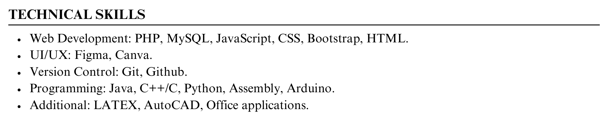

    

        <a href="https://taher-portfolio.pages.dev" target="_blank"><b>⭐ Portfolio</b></a> |
        <a href="https://www.linkedin.com/in/taher-mahmud-monmoy" target="_blank"><b>💼 Linkedin</b></a> |
        <a href="taher-cv.pdf" target="_blank"><b>📜 Resume</b></a> 
    

I am Taher Mahmud, a student from Dhaka, Bangladesh, currently pursuing my Bachelor’s degree in **Computer Science and Engineering** at Green University of Bangladesh.

	

	
	

