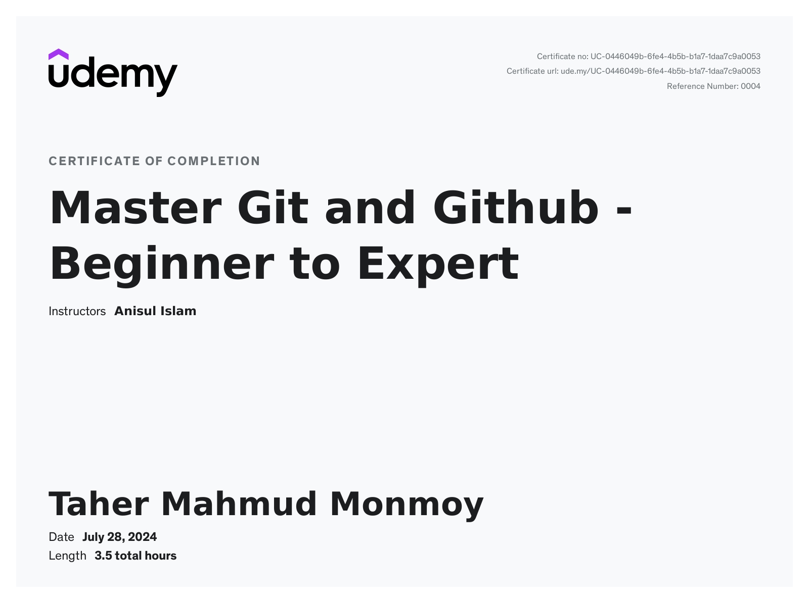

## 👋🏻 Hello, I'm Taher Mahmud Monmoy

Student | B.Sc. in Computer Science and Engineering | Aspiring web developer

🏠 Living: Dhaka, Bangladesh

### Contact Me

[][linkedin]
[][facebook]
[][instagram]
[][email]
 
 

### Introduction

I am a passionate computer science and engineering student, aspiring to become a web developer. I am constantly studying and building projects to improve myself.

 

### 💻 Skills

#### Key Skills in Web Development

| **HTML**      | **CSS**       | **JavaScript** | **Github** |
| ------------- | ------------- | -------------- | ---------- |
| **Bootstrap** | **Wordpress** | **MySQL**      |

#### Other Skills

| **C** | **C++** | **Java** | **Python** |
| ----- | ------- | -------- | ---------- |

 

### Projects

1. [Food-Delivery-Website](https://taher-dev.github.io/Food-Website/)
2. [Employee-Management-System](https://github.com/taher-dev/Employee-Management-System/tree/master)
3. [Sample-Project](https://taher-dev.github.io/sample-project-1/)

 

### 🎓 Education

1. B.Sc. in Computer Science & Engineering  
   Green University of Bangladesh  
   Dhaka, Bangladesh.
2. Higher Secondary School Certificate in Science  
   Kabi Nazrul Government College  
   Dhaka, Bangladesh.
3. Secondary School Certificate in Science  
   Motijheel Model School & College  
   Dhaka, Bangladesh.

 

### Certifications

[][generative-ai]

[][git-and-github]

 

### Languages

- Bangla: Native
- English: Intermediate
- Hindi: Basic
- Urdu: Basic

 

### Hobby

- ♟️ Chess, 🏸 Badminton
- 🏃‍♂️ Running, 🚶‍♂️ Walking
- ✈️ Travelling

 

---

Thanks for going through my Portfolio.
All rights reserved by Taher Mahmud Monmoy @2024

---

[linkedin]: www.linkedin.com/in/taher-mahmud-monmoy
[facebook]: https://www.facebook.com/monmoyzx?mibextid=kFxxJD
[instagram]: https://www.instagram.com/_red_uzumaki_?igsh=MWNoZmdtYTBmZHBlOQ==
[email]: monmoyzx@gmail.com

<!-- Certificates link -->

[generative-ai]: https://www.linkedin.com/learning/certificates/a08138935eac8e5b7a055cf588be52a9046dc55bf70a8e2c21e5240143e15b65?trk=share_certificate
[git-and-github]: https://www.udemy.com/certificate/UC-0446049b-6fe4-4b5b-b1a7-1daa7c9a0053/
